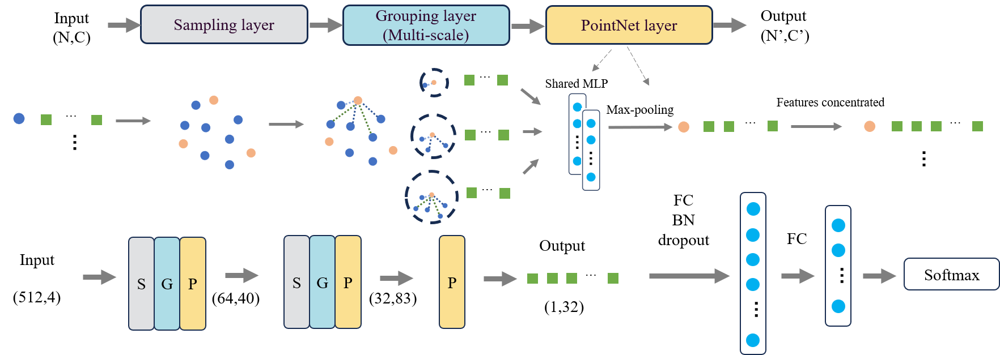
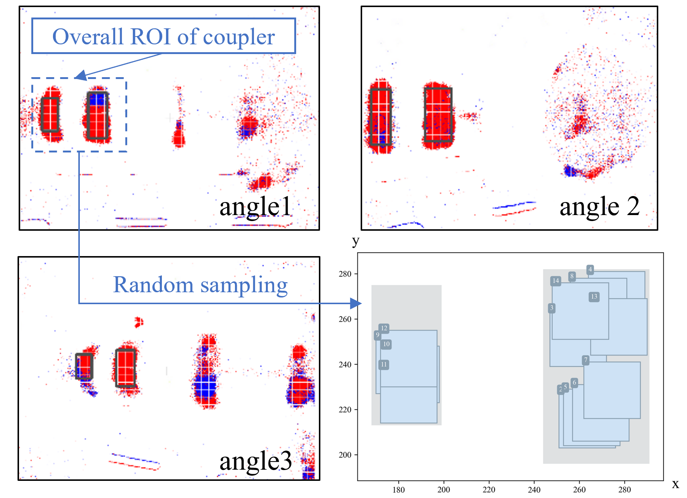

# Dynamic Vision-Enabled Machine Condition Monitoring
This article presents one of the pioneering attempts in the current literature on using a 3D point cloud data algorithm to process event data for machine fault diagnosis. A geometric data structure is proposed to represent event information and a deep learning method on point cloud data is employed for classification to perform diagnosis tasks. The article conducts experiments on diagnosing rotating machine faults using event-based cameras.




**Figure 1:** The experimental setup used to collect event-based data for fault diagnosis.

## Setup Instructions

### Prerequisites
Ensure the following software is installed:
- **Python 3.x**
### Installation Steps
Clone the repository:
```bash
git clone https://github.com/Tamphie/Dynamic_vision.git
cd Dynamic_vision/faultNet
```
## Repository Structure

### Main Scripts
- **`train_classification.py`**: Script for training the fault classification model.
- **`test_classification.py`**: Script for evaluating the trained classification model.
- **`train_partseg.py`**: Script for part segmentation tasks (if applicable).
- **`train_semseg.py`**: Script for semantic segmentation tasks (if applicable).


**Figure 2:** The network architecture designed for classifying fault types

### Data Preprocessing
- **`Generate_txt_*.py`**: Scripts for generating point cloud data files from event data for specific fault types (e.g., ball, healthy, inner race, outer race).
- **`dat_to_txt.py`**: Converts `.dat` files (raw event data) into text-based formats for further processing.
- **`load_data_to_txt.py`**: Handles data loading and transformation into required formats.

### Event Data Visualization and Analysis
- **`dataset_visualization.py`**: Visualizes datasets for better understanding and debugging.
- **`event_count.py`**: Counts events for data statistics.
- **`fft.py`**: Computes Fast Fourier Transform for frequency-domain analysis.
- **`random_roi_fig.py`**: Creates figures of random regions of interest for visualization purposes.
  

**Figure 3:** Visualization of randomly selected regions of interest (ROIs) from the dataset. These ROIs demonstrate the spatial distribution of event data points captured by the dynamic vision sensor.

### Utility Scripts during Experiments
- **`obtain_file_names.py`**: Helper script for managing file names and paths.
- **`loadResult.py`**: Loads and manages experiment results.
- **`read_total_time.py`**: Processes timing information for experiments.

## Contributions
Feel free to contribute by submitting pull requests or issues. For major changes, please open an issue to discuss proposed modifications.


